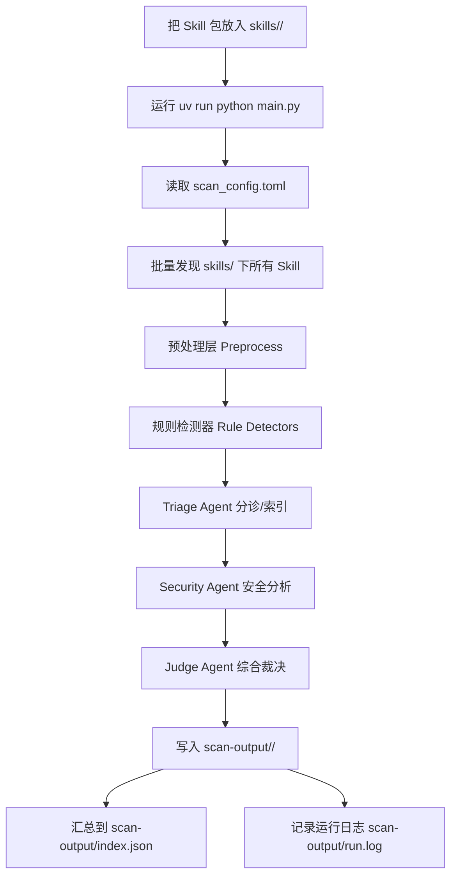

# Skill Scan

本目录是并入 `SAFE-Agent` 仓库的 `Skill-Scan` 后端与数据副本，用于为站内 `技能可信安全检测` 页面提供本地服务。

在本目录下可直接启动服务：

```bash
uv run safe-agent-skillpecker-web
```

默认监听 `127.0.0.1:8010`，对应前端代理路径为 `frontend/app/api/skillpecker/[...path]/route.ts`。

`Skill Scan` 是一个面向 AI Skill 包的批量扫描器，用来识别三类问题：

- 恶意行为风险（Malicious Risk）
- 实现不安全 / 不可靠（Unsafe or Unreliable Implementation）
- 描述不可靠（Misleading or Unreliable Description）

默认情况下，你只需要把待扫描的 Skill 包放进固定目录，然后运行一条命令即可。

## 一、目录约定

项目根目录下最重要的几个位置：

- `skills/`
  存放待扫描的 Skill 包。每个 Skill 必须是一个独立子目录。
- `scan-output/`
  存放扫描结果、批量索引和运行日志。
- `scan_config.toml`
  扫描配置文件。
- `main.py`
  零参数入口脚本。

推荐结构如下：

```text
Skill-Scan/
├─ skills/
│  ├─ skill-a/
│  │  ├─ SKILL.md
│  │  ├─ scripts/
│  │  └─ ...
│  ├─ skill-b/
│  │  ├─ SKILL.md
│  │  └─ ...
│  └─ ...
├─ scan-output/
├─ scan_config.toml
└─ main.py
```

## 二、如何使用

### 1. 安装依赖

如果使用 `uv`：

```bash
uv sync
```

### 2. 放入 Skill 包

把所有要扫描的 Skill 包放到 `skills/` 目录下。

例如：

```text
skills/
├─ skill-1/
├─ skill-2/
├─ skill-3/
└─ ...
```

扫描器会自动扫描 `skills/` 下的每一个直接子目录。

### 3. 配置扫描参数

编辑 `scan_config.toml`，至少确认以下内容：

- `paths.skills_dir`
  Skill 包目录，默认是 `skills`
- `paths.output_dir`
  输出目录，默认是 `scan-output`
- `scan.preprocess_only`
  是否只跑本地预处理和规则扫描
- `llm.provider`
  选择要使用的大模型提供方
- `llm.api_key`
  模型 API Key
- `llm.base_url`
  模型服务地址。通常留空即可，程序会按 provider 自动选择默认地址
- `llm.model`
  模型名称
- `logging.level`
  日志级别，例如 `INFO` 或 `DEBUG`

常见 `llm.provider` 可选值：

- `deepseek`
- `openai`
- `openrouter`
- `groq`
- `moonshot`
- `together`
- `siliconflow`
- `dashscope`
- `anthropic`
- `gemini`

示例配置：

```toml
[llm]
provider = "deepseek"
api_key = "your-api-key"
base_url = ""
model = "deepseek-chat"
temperature = 0.0
request_timeout_seconds = 120
```

```toml
[llm]
provider = "openai"
api_key = "your-api-key"
base_url = ""
model = "gpt-4o-mini"
temperature = 0.0
request_timeout_seconds = 120
```

```toml
[llm]
provider = "anthropic"
api_key = "your-api-key"
base_url = ""
model = "claude-3-5-sonnet-20241022"
temperature = 0.0
request_timeout_seconds = 120
```

```toml
[llm]
provider = "gemini"
api_key = "your-api-key"
base_url = ""
model = "gemini-2.0-flash"
temperature = 0.0
request_timeout_seconds = 120
```

### 4. 运行扫描

```bash
uv run python main.py
```

或者：

```bash
uv run skill-scan
```

## 三、扫描流程图



## 四、输出结果包含什么

每个 Skill 会在 `scan-output/<skill-name>/` 下生成两套结果：

- `*.json`
  给人看的可读版本，字段名是中文（英文）
- `*.raw.json`
  给程序看的原始版本，保留内部英文结构

例如：

```text
scan-output/
├─ index.json
├─ index.raw.json
├─ run.log
├─ skill-a/
│  ├─ preprocess.json
│  ├─ preprocess.raw.json
│  ├─ triage.json
│  ├─ triage.raw.json
│  ├─ security.json
│  ├─ security.raw.json
│  ├─ judge.json
│  ├─ judge.raw.json
│  ├─ scan-result.json
│  └─ scan-result.raw.json
└─ skill-b/
   └─ ...
```

### 1. `preprocess.json`

预处理结果。描述这个 Skill 里有哪些文件、初步命中了哪些规则。

顶层字段：

- `技能信息 (skill_info)`
  Skill 的路径、声明、观察到的文件类型
- `文件制品列表 (artifacts)`
  扫描到的文件列表
- `规则命中列表 (rule_hits)`
  本地规则检测命中的问题
- `覆盖缺口列表 (coverage_gaps)`
  哪些文件因为二进制、过大、截断等原因没有被完整分析
- `统计信息 (statistics)`
  文件数、规则命中数、按严重级别和规则代码统计

### 2. `triage.json`

分诊阶段结果。作用是建立索引、标记重点、告诉后续 Agent 去看哪里。

顶层字段：

- `技能概览 (skill_overview)`
  Skill 的声明、观察到的行为、高风险特征
- `文件分析列表 (artifact_reviews)`
  每个重点文件的简要分析
- `跨文件关注点 (cross_artifact_concerns)`
  跨文件的综合关注点，例如“恶意候选”“描述缺口”
- `建议回源片段 (retrieval_requests)`
  建议进一步读取的原文片段
- `覆盖情况 (coverage)`
  当前索引覆盖情况

### 3. `security.json`

安全分析阶段结果。这里会列出真正的问题发现。

顶层字段：

- `发现列表 (findings)`
  所有安全 / 描述 / 恶意相关发现
- `补充上下文请求 (additional_context_requests)`
  如果证据不够，Security Agent 还会请求更多上下文
- `覆盖情况 (coverage)`
  已审阅制品、未解决高风险制品

### 4. `judge.json`

最终裁决结果。这里是最适合直接阅读的总结文件。

顶层字段：

- `最终裁决 (verdict)`
  最终标签、主问题类型、风险分数
- `主要发现 (top_findings)`
  最重要的几个问题
- `覆盖审计 (coverage_audit)`
  当前扫描是否充分，哪里还遗漏
- `下一步动作 (next_action)`
  是否建议重扫，以及怎么重扫

### 5. `scan-result.json`

整合版输出。把 `preprocess`、`triage`、`security`、`judge` 放在一个文件里，方便一次性查看。

### 6. `index.json`

批量扫描总览。汇总所有 Skill 的扫描状态、输出目录和裁决摘要。

### 7. `run.log`

运行日志。用于排查当前扫描到了哪个 Skill、哪个阶段、哪里报错。

## 五、重点字段是什么意思

下面解释你最常看的字段。

### 1. `最终裁决 (verdict)` 中的字段

- `裁决标签 (label)`
  最终判定结果
- `主要问题类型 (primary_concern)`
  当前最主要的问题类型
- `问题类型列表 (issue_types)`
  这个 Skill 同时涉及到哪些问题类型
- `恶意风险分，越高越危险 (maliciousness_score)`
  恶意性风险分，通常范围 0 到 10，越高表示越像恶意 Skill
- `实现风险分，越高越危险 (implementation_risk_score)`
  实现层面的风险分，越高表示越不安全 / 越不可靠
- `描述可靠度分，越低越不可靠 (description_reliability_score)`
  描述可靠度分，越低说明文档越不可信
- `覆盖度分，越高越完整 (coverage_score)`
  当前扫描覆盖度，越高表示看得越完整

### 2. `裁决标签 (label)` 的含义

- `恶意 (malicious)`
  有明确恶意行为，或高度可疑的有害行为
- `不安全/不可靠 (unsafe)`
  没有明显恶意，但实现本身存在漏洞、不安全做法或严重不可靠行为
- `描述不可靠 (description_unreliable)`
  主要问题出在描述、说明、权限告知、隐私预期等不可靠
- `混合风险 (mixed_risk)`
  同时存在多类明显问题
- `基本干净但有保留 (clean_with_reservations)`
  没有看到明确高风险问题，但仍有一些值得保留的点
- `证据不足 (insufficient_evidence)`
  当前证据或覆盖不够，不能下强结论

### 3. `问题性质 (finding_class)` 的含义

- `恶意/有害 (malicious)`
  更偏主动攻击、隐蔽、有害、绕过、窃取、破坏
- `不安全/不可靠 (unsafe)`
  更偏漏洞、坏例子、错误实现、会导致风险的做法
- `描述不可靠 (description)`
  更偏文档不可信、说明缺失、承诺与实际不一致

### 4. `证据位置 (evidence_spans)` 的含义

每条证据一般包含：

- `文件路径 (path)`
  证据来自哪个文件
- `起始行 (start_line)`
  证据起始行
- `结束行 (end_line)`
  证据结束行
- `说明 (why)`
  为什么这段内容被当作证据

### 5. `文件制品列表 (artifacts)` 中常见字段

- `文件路径 (path)`
  文件相对路径
- `文件类型 (kind)`
  Markdown、Shell、Python、JSON 等
- `文件角色 (role)`
  是 Skill 定义、脚本、文档、配置还是辅助材料
- `预览 (preview)`
  文件前若干行摘要
- `是否截断 (is_truncated)`
  文件是否因为过大而只读取了一部分
- `是否二进制 (is_binary)`
  是否是不可直接文本分析的二进制文件
- `规则命中数 (rule_hit_count)`
  本地规则命中的数量

### 6. `跨文件关注点 (cross_artifact_concerns)` 中常见字段

- `恶意候选 (malicious_candidate)`
  当前像恶意行为，但还需要更多证据
- `不安全候选 (unsafe_candidate)`
  当前像漏洞、不安全实现或不可靠行为
- `描述缺口 (description_gap)`
  当前像说明缺失、承诺不符或误导性描述

## 六、日志怎么看

运行时会同时输出控制台日志和文件日志：

- 控制台：方便看当前扫描进度
- 文件：`scan-output/run.log`

如果想看更细的调试信息，可以把 `scan_config.toml` 中的：

```toml
[logging]
level = "DEBUG"
```

这样会看到更多细节，例如：

- 当前在扫哪个 Skill
- 当前跑到 `preprocess / triage / security / judge` 的哪个阶段
- 每一步用了多久
- 命中了多少规则
- LLM 调用了几次

## 七、推荐阅读顺序

如果你只想快速判断一个 Skill 有没有问题，建议按这个顺序看：

1. `scan-output/index.json`
   先看所有 Skill 的总体结果
2. `scan-output/<skill-name>/judge.json`
   看某个 Skill 的最终结论
3. `scan-output/<skill-name>/security.json`
   看具体有哪些发现
4. `scan-output/<skill-name>/preprocess.json`
   看底层规则和文件结构
5. `scan-output/run.log`
   看运行过程和报错
