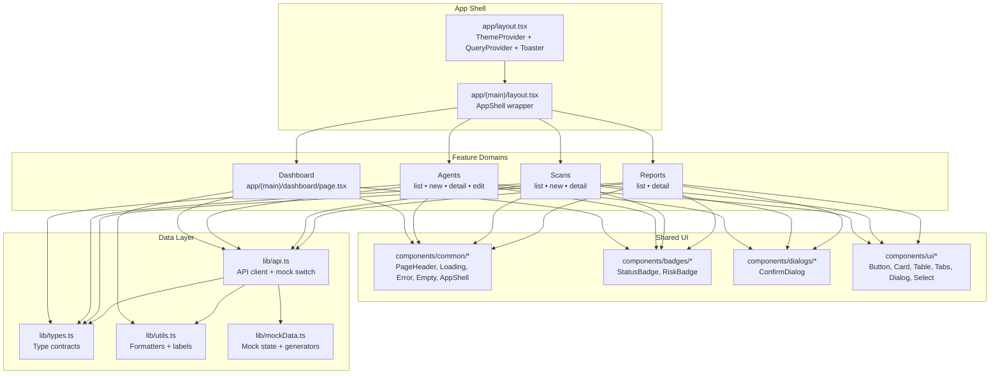

# Frontend Architecture

## Overview
This document describes the front-end module architecture for the SAFE-Agent UI. It follows a typical product documentation format: scope, diagram, module map, and data flow.

## Scope
- UI shell, routing, and feature domains
- Shared UI components and utilities
- Data access layer and mock data flow

## Architecture Diagram (Mermaid)

## Module Map
- App Shell: global layout, theme, query client, toasts
- Dashboard: KPIs + recent scans/reports
- Agents: CRUD for agent definitions
- Scans: create/track/cancel scan tasks
- Reports: list, detail, and export
- Shared UI: reusable components for layout, forms, and feedback
- Data Layer: API client with mock switch, types, and utilities

## Data Flow
1. Page component requests data via `lib/api.ts`.
2. API client routes to real backend or mock state (via `NEXT_PUBLIC_USE_MOCK`).
3. Data returns to React Query hooks and renders in feature pages.

## Key Dependencies
- Next.js App Router
- React Query
- Tailwind CSS
- Framer Motion
- Recharts

## File Locations
- Diagram source: `docs/frontend-architecture.md`
